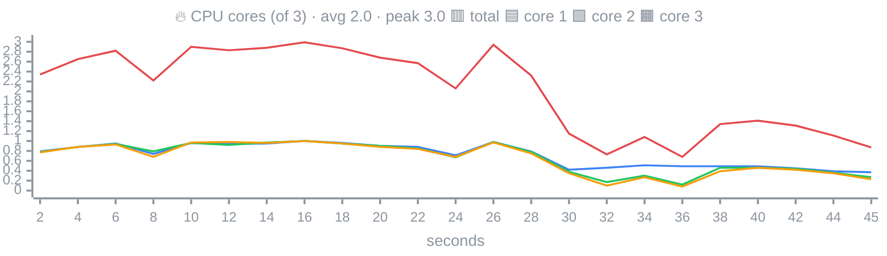
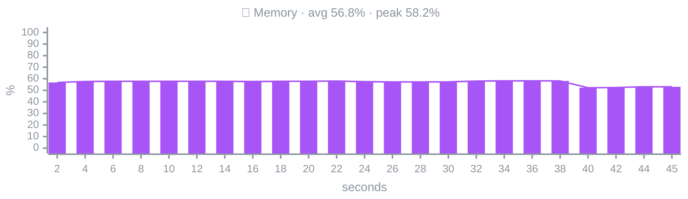
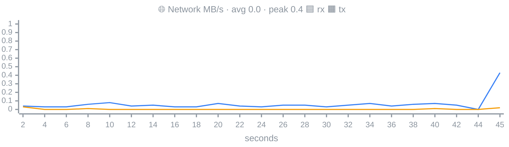
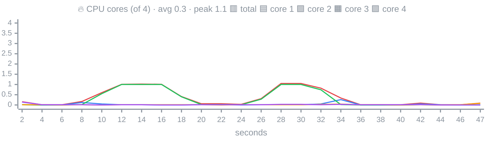
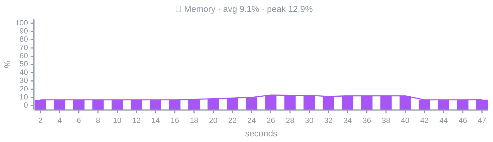
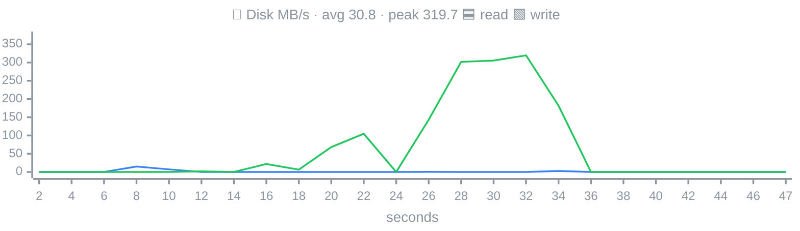
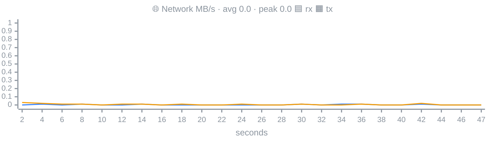

```mermaid
gantt
    title Steps
    dateFormat X
    axisFormat %Ss
    section job
    Run actions/checkout@v7 :s2, 0, 1
    Idle :s4, 0, 6
    Workload (cpu, memory, disk, network) :s5, 6, 41
    Cool down :s6, 41, 47
    Post Run ./ :s11, 47, 48
```

<!-- Generated by scripts/render-demo.ts from a real demo workflow run. -->

These are the job summaries the action produced in the [demo workflow](https://github.com/ingarabr/gha-ekg/actions/workflows/demo.yml). Each job ran the same synthetic CPU, memory, disk and network workload.

# demo (macos-latest, mermaid)

## gha-ekg · darwin/arm64

| | |
|---|---|
| Runner | darwin/arm64, 3 CPUs, 7.0 GB RAM |
| Duration | 45s (23 samples every 2s) |
| CPU | avg 69%, peak 100% |
| Memory | peak 4.1 GB (58%) |
| Disk | read n/a, write n/a |
| Network | rx 2.4 MB, tx 205 KB |

### Timeline





_💾 Disk MB/s: n/a on this platform_

```mermaid
gantt
    title Steps
    dateFormat X
    axisFormat %Ss
    section job
    Set up job :s1, 0, 1
    Run actions/checkout@v7 :s2, 0, 1
    Idle :s4, 0, 6
    Workload (cpu, memory, disk, network) :s5, 6, 39
    Cool down :s6, 39, 45
    Post Run ./ :s11, 45, 47
    Complete job :s13, 47, 48
```





### Steps

| Step | Duration | CPU avg / peak | Mem peak | Disk r / w | Net rx / tx |
|---|---|---|---|---|---|
| 1. Set up job | 1s | – | – | – | – |
| 2. Run actions/checkout@v7 | 2s | – | – | – | – |
| 3. Run ./ | 0s | – | – | – | – |
| 4. Idle | 6s | 83% / 88% | 4.0 GB | n/a / n/a | 135 KB / 57 KB |
| 5. Workload (cpu, memory, disk, network) | 33s | 73% / 100% | 4.1 GB | n/a / n/a | 1.6 MB / 99 KB |
| 6. Cool down | 6s | 43% / 47% | 3.7 GB | n/a / n/a | 253 KB / 26 KB |
| 11. Post Run ./ | 2s | 29% / 29% | 3.7 GB | n/a / n/a | 435 KB / 23 KB |
| 12. Post Run actions/checkout@v7 | 0s | – | – | – | – |
| 13. Complete job | 1s | – | – | – | – |

_Steps shorter than the sampling interval have no samples._

---

# demo (ubuntu-24.04-arm, mermaid)

## gha-ekg · linux/arm64

| | |
|---|---|
| Runner | linux/arm64, 4 CPUs, 16 GB RAM |
| Duration | 47s (24 samples every 2s) |
| CPU | avg 7%, peak 26% |
| Memory | peak 2.0 GB (13%) |
| Disk | read 50 MB, write 2.8 GB |
| Network | rx 168 KB, tx 266 KB |

### Timeline











### Steps

| Step | Duration | CPU avg / peak | Mem peak | Disk r / w | Net rx / tx |
|---|---|---|---|---|---|
| 1. Set up job | 0s | – | – | – | – |
| 2. Run actions/checkout@v7 | 2s | – | – | – | – |
| 3. Run ./ | 0s | – | – | – | – |
| 4. Idle | 6s | 2% / 4% | 1.1 GB | 88 KB / 4.0 KB | 25 KB / 103 KB |
| 5. Workload (cpu, memory, disk, network) | 35s | 8% / 26% | 2.0 GB | 50 MB / 2.8 GB | 127 KB / 124 KB |
| 6. Cool down | 6s | 1% / 2% | 1.1 GB | 0 B / 8.0 KB | 15 KB / 39 KB |
| 11. Post Run ./ | 1s | 2% / 2% | 1.1 GB | 0 B / 0 B | 0 B / 0 B |
| 12. Post Run actions/checkout@v7 | 0s | – | – | – | – |
| 13. Complete job | 0s | – | – | – | – |

_Steps shorter than the sampling interval have no samples._

---

# demo (ubuntu-latest, ascii)

## gha-ekg · linux/x64

| | |
|---|---|
| Runner | linux/x64, 4 CPUs, 16 GB RAM |
| Duration | 45s (23 samples every 2s) |
| CPU | avg 10%, peak 40% |
| Memory | peak 1.9 GB (12%) |
| Disk | read 120 MB, write 3.3 GB |
| Network | rx 131 KB, tx 274 KB |

### Timeline

```
CPU         ▁▁▁▃▃▃▄▃▁▁▁▁▁▁▁▁▁▁▁▁▁▁▁  peak 40%
Memory      ▁▁▁▁▁▁▁▁▁▁▁▁▁▁▁▁▁▁▁▁▁▁▁  peak 12%
Disk read   ▁▁▁▅▁▁█▁▁▁▁▁▁▁▁▁▁▁▁▁▁▁▁  peak 37 MB/s
Disk write  ▁▁▁▁▁▁▁▁▁▁▁████▃▁▁▁▁▁▁▁  peak 394 MB/s
Net rx      ▅▆▁▄▁▁▂▁▁▂▁▆▂▁▁█▃▄▆▅▁▂▁  peak 10 KB/s
Net tx      █▅▁▅▁▁▂▁▁▂▁▂▂▁▁▂▁▁▂▄▁▂▃  peak 35 KB/s
```

### Steps

| Step | Duration | CPU avg / peak | Mem peak | Disk r / w | Net rx / tx |
|---|---|---|---|---|---|
| 1. Set up job | 1s | – | – | – | – |
| 2. Run actions/checkout@v7 | 1s | – | – | – | – |
| 3. Run ./ | 0s | – | – | – | – |
| 4. Idle | 6s | 3% / 6% | 965 MB | 544 KB / 8.0 KB | 27 KB / 113 KB |
| 5. Workload (cpu, memory, disk, network) | 32s | 13% / 40% | 1.9 GB | 119 MB / 3.3 GB | 72 KB / 98 KB |
| 6. Cool down | 6s | 1% / 2% | 1.7 GB | 0 B / 8.0 KB | 26 KB / 45 KB |
| 11. Post Run ./ | 2s | 1% / 5% | 1.0 GB | 0 B / 4.0 KB | 5.0 KB / 19 KB |
| 12. Post Run actions/checkout@v7 | 0s | – | – | – | – |
| 13. Complete job | 0s | – | – | – | – |

_Steps shorter than the sampling interval have no samples._

---

# demo (windows-latest, ascii)

## gha-ekg · win32/x64

| | |
|---|---|
| Runner | win32/x64, 4 CPUs, 16 GB RAM |
| Duration | 47s (22 samples every 2s) |
| CPU | avg 19%, peak 45% |
| Memory | peak 3.4 GB (21%) |
| Disk | read n/a, write n/a |
| Network | rx n/a, tx n/a |

### Timeline

```
CPU         ▁▂▂▃▃▃▄▂▄▃▂▂▂▁▁▂▂▂▁▂▁▂  peak 45%
Memory      ▂▂▂▂▂▂▂▂▂▂▂▂▂▂▂▂▂▂▂▂▂▂  peak 21%
Disk read   n/a
Disk write  n/a
Net rx      n/a
Net tx      n/a
```

### Steps

| Step | Duration | CPU avg / peak | Mem peak | Disk r / w | Net rx / tx |
|---|---|---|---|---|---|
| 1. Set up job | 1s | – | – | – | – |
| 2. Run actions/checkout@v7 | 5s | – | – | – | – |
| 3. Run ./ | 0s | – | – | – | – |
| 4. Idle | 6s | 12% / 12% | 2.5 GB | n/a / n/a | n/a / n/a |
| 5. Workload (cpu, memory, disk, network) | 35s | 22% / 45% | 3.4 GB | n/a / n/a | n/a / n/a |
| 6. Cool down | 6s | 14% / 18% | 3.3 GB | n/a / n/a | n/a / n/a |
| 11. Post Run ./ | 2s | 15% / 15% | 2.6 GB | n/a / n/a | n/a / n/a |
| 12. Post Run actions/checkout@v7 | 3s | – | – | – | – |
| 13. Complete job | 0s | – | – | – | – |

_Steps shorter than the sampling interval have no samples._
